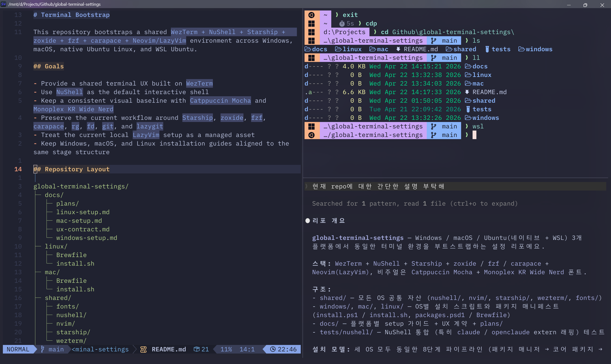

# Global Terminal Settings

This repository bootstraps a shared `WezTerm + NuShell + aqua-managed CLI + mise-managed runtimes + Neovim/LazyVim` environment across Windows, macOS, native Ubuntu Linux, and WSL Ubuntu.



## Goals

- Provide a shared terminal UX built on `WezTerm`
- Use `NuShell` as the default interactive shell
- Keep a consistent visual baseline with `Catppuccin Mocha` and `Monoplex KR Wide Nerd`
- Preserve the current workflow around `Starship`, `zoxide`, `fzf`, `carapace`, `rg`, `fd`, `git`, and `lazygit`
- Keep OS package managers focused on terminal bootstrap, with daily cross-platform CLIs managed by `aqua`
- Use `mise` as the single cross-platform language runtime manager (Java, Python, etc.), pinned to the versions in `shared/mise/config.toml`
- Treat the current local `LazyVim` setup as a managed asset
- Keep Windows, macOS, and Linux installation guides aligned to the same stage structure

## Repository Layout

```text
global-terminal-settings/
├─ docs/
│  ├─ plans/
│  ├─ linux-setup.md
│  ├─ mac-setup.md
│  ├─ ux-contract.md
│  └─ windows-setup.md
├─ linux/
│  ├─ Brewfile
│  └─ install.sh
├─ mac/
│  ├─ Brewfile
│  └─ install.sh
├─ shared/
│  ├─ aqua/
│  ├─ fonts/
│  ├─ mise/
│  ├─ nushell/
│  ├─ nvim/
│  ├─ starship/
│  └─ wezterm/
└─ windows/
   ├─ install.ps1
   └─ packages.psd1
```

## Managed Assets

- `shared/fonts/MonoplexKRWideNerd/`
  - Source font assets staged into the per-user install root under `fonts/`
- `shared/aqua/aqua.yaml`
  - Managed aqua global config for daily cross-platform CLIs such as `rg`, `fd`, `fzf`, `zoxide`, `starship`, `carapace`, `lazygit`, `btm`, `nvim`, and related tools
- `shared/mise/config.toml`
  - Managed mise global config that pins shared language runtimes (Java, Python). Installed to `~/.config/mise/config.toml` on POSIX and `%USERPROFILE%\.config\mise\config.toml` on Windows
- `Symbols Nerd Font Mono` (macOS: `font-symbols-only-nerd-font` Homebrew cask)
  - Installed system-wide so GUI terminals (JetBrains IDEs and similar) can resolve the full Nerd Font symbol range; WezTerm references it as a fallback after `Monoplex KR Wide Nerd` for codepoints the primary font does not ship
- `shared/nushell/`
  - Shared `config.nu`, `env.nu`, `login.nu`
  - NuShell integration layer for WezTerm and optional `claude` / `openclaude` extern wiring
- `shared/nvim/`
  - Current `LazyVim` configuration snapshot
- `shared/starship/starship.toml`
  - Shared prompt configuration
- `shared/wezterm/wezterm.lua`
  - Shared WezTerm configuration

## Installation Model

The installers first stage managed assets into a per-user install root and then copy them into the application-specific locations by default. `--sync-mode auto` and `--sync-mode link` are available for workflows that still want link-based deployment. NuShell managed files are always copied into the resolved NuShell config directory as standalone files so the live shell config does not depend on the staging root or the repository checkout.

- Windows install root: `%USERPROFILE%\.config\terminal-bootstrap\`
- macOS install root: `~/.config/terminal-bootstrap/` by default
- If `XDG_CONFIG_HOME` is set on macOS, the installer uses `$XDG_CONFIG_HOME/terminal-bootstrap/`
- Existing managed targets are moved to `<target>.pre-terminal-bootstrap` before replacement; subsequent runs overwrite that file, so at most one backup per target is retained

- `~/.wezterm.lua`
- Windows: `%USERPROFILE%\.config\starship.toml`
- macOS: `~/.config/starship.toml` by default
- If `XDG_CONFIG_HOME` is set on macOS, the installer uses `$XDG_CONFIG_HOME/starship.toml`
- Windows NuShell config dir: `%USERPROFILE%\.config\nushell\`
- Windows aqua config: `%USERPROFILE%\.config\aquaproj-aqua\aqua.yaml`
- Windows aqua root: `%SystemDrive%\.aqua` via user `AQUA_ROOT_DIR`
- Windows cache root: `%USERPROFILE%\.cache` via user `XDG_CACHE_HOME`
- macOS NuShell config dir: `~/.config/nushell/` by default
- If `XDG_CONFIG_HOME` is set on macOS, the installer uses `$XDG_CONFIG_HOME/nushell/`
- macOS aqua config: `~/.config/aquaproj-aqua/aqua.yaml` by default, or `$XDG_CONFIG_HOME/aquaproj-aqua/aqua.yaml` when `XDG_CONFIG_HOME` is set
- Linux aqua config: `$XDG_CONFIG_HOME/aquaproj-aqua/aqua.yaml` when set, otherwise `~/.config/aquaproj-aqua/aqua.yaml`
- Windows mise config: `%USERPROFILE%\.config\mise\config.toml`
- macOS mise config: `~/.config/mise/config.toml` by default, or `$XDG_CONFIG_HOME/mise/config.toml` when `XDG_CONFIG_HOME` is set
- Linux mise config: `$XDG_CONFIG_HOME/mise/config.toml` when set, otherwise `~/.config/mise/config.toml`
- Windows: `%USERPROFILE%\.config\nvim` (aligned with the user `XDG_CONFIG_HOME` the installer sets; pre-existing `%LOCALAPPDATA%\nvim` is backed up once and skipped thereafter)
- macOS: `~/.config/nvim` by default
- If `XDG_CONFIG_HOME` is set on macOS, the installer uses `$XDG_CONFIG_HOME/nvim`
- Linux (native and WSL): `$XDG_CONFIG_HOME/nvim` when set, otherwise `~/.config/nvim`

The installers stage `shared/aqua/aqua.yaml` into the live aqua config root and opportunistically run `aqua install -a`; lazy install remains the fallback if a package install fails during bootstrap. The installers also stage `shared/mise/config.toml` into the live mise config root and run `mise install -y` so the pinned Java and Python runtimes are present after bootstrap; if the mise binary is unavailable at install time the step warns and continues, and a later `mise install` picks up the shared baseline. NuShell's `env.nu` exposes `AQUA_GLOBAL_CONFIG` when that file exists and prepends aqua's root `bin` directory when present, so aqua-managed CLIs win over fallback OS paths. It also prepends the resolved mise shim directory (`~/.local/share/mise/shims` on POSIX, `%LOCALAPPDATA%\mise\shims` on Windows, or `$MISE_DATA_DIR/shims` when set) so mise-managed runtimes resolve from any NuShell session, including GUI-launched ones. On Windows, the installer also sets user `AQUA_GLOBAL_CONFIG` when absent, sets user `AQUA_ROOT_DIR=%SystemDrive%\.aqua` when absent, persists aqua's root `bin` in the user `PATH`, and sets user `XDG_CACHE_HOME=%USERPROFILE%\.cache` when absent. The short aqua root keeps aqua-managed Neovim's runtime path short before Neovim encodes that path into Lua loader cache filenames. A machine-wide legacy install that remains earlier in the machine `PATH` can still win in PowerShell or `cmd`; remove that legacy install or machine `PATH` entry when fully migrating a tool to aqua.

The NuShell `carapace`, `Starship`, and `zoxide` init files are generated into the real NuShell `autoload/` directory from the available binaries, including aqua-provided binaries after install, and `config.nu` sources them when those files are present. The generated `starship.nu` uses the resolved real Starship binary path, prefers `aqua which starship` when available, disables the NuShell right-prompt path, and catches prompt-render failures so an interrupted foreground command cannot reset the terminal UI through a prompt hook error. `autoload/zz-prompt-overrides.nu` is a managed late-load guard; the `zz-` prefix keeps it after other autoload snippets in NuShell's alphabetical load order. Managed and generated autoload files may be temporarily absent during bootstrap or repair without blocking shell startup. The managed NuShell layer also stages `claude-integration.nu` and `openclaude-integration.nu`, and writes `claude.nu` / `openclaude.nu` markers during install, but startup does not depend on any of those files. If the `claude` or `openclaude` CLI is not installed, the corresponding integration stays inactive and the shell still starts cleanly. `config.nu` also optionally sources `autoload/user-overrides.nu` when present; this file is user-managed and is not overwritten by reinstall, so OS-specific aliases, Java/runtime setup, and custom scripts can live there. On Windows, rerunning the installer repairs the live NuShell files in `~/.config/nushell`, sets user `XDG_CONFIG_HOME=~/.config`, recreates `%APPDATA%\nushell` as a compatibility junction to the same live root so standalone `nu` and `exec nu` see the same config, backs up obsolete legacy autoload artifacts such as `openclaude-completions.nu`, and backs up an existing legacy `%APPDATA%\nushell` tree before rebuilding the junction. On macOS, the managed WezTerm entrypoint sets `XDG_CONFIG_HOME=~/.config` so the live NuShell runtime resolves from `~/.config/nushell` instead of `~/Library/Application Support/nushell`. The macOS installer also links `~/Library/Application Support/nushell` to the managed NuShell config root so GUI-launched processes that do not inherit `XDG_CONFIG_HOME` (JetBrains IDE terminals, Raycast, etc.) still resolve the same live configuration.

The shared `WezTerm + NuShell` baseline disables `shell_integration.osc133` for redraw stability across all platforms. The prompt model uses a single left `Starship` prompt and disables NuShell's built-in `vi` indicators and right-prompt path.

## Shared Installation Stages

Windows, macOS, and Linux (native and WSL) use the same eight installation stages.

1. Package manager readiness
2. Core packages
3. Stage managed assets
4. Wire WezTerm, aqua, and mise config
5. Wire NuShell
6. Install aqua packages, install mise runtimes, and wire Starship, zoxide, carapace, and optional claude / openclaude integration
7. Sync LazyVim
8. Verify

Only the concrete commands and package sources differ.

- Windows: `winget` first, `choco` only when already installed and the package allows fallback
- macOS: `brew`
- Linux (native and WSL Ubuntu): `apt` for Linuxbrew bootstrap dependencies, then `brew` for the bootstrap baseline
- `aqua` manages daily cross-platform CLIs after the OS bootstrap is ready
- `mise` manages cross-platform language runtimes (Java, Python, etc.); the shared pinned set lives in `shared/mise/config.toml`
- WSL defers font and WezTerm deployment to the Windows host; the Windows installer registers a `wsl_domains` entry so WezTerm can enter the WSL `nu` session directly
- `claude` and `openclaude` themselves remain external prerequisites; this repo only wires shell integration when the command is already available

## Entry Points

- Windows setup guide: [docs/windows-setup.md](docs/windows-setup.md)
- macOS setup guide: [docs/mac-setup.md](docs/mac-setup.md)
- Linux and WSL setup guide: [docs/linux-setup.md](docs/linux-setup.md)
- Shared UX contract: [docs/ux-contract.md](docs/ux-contract.md)
- Historical design and implementation plans: [docs/plans/archive/](docs/plans/archive/)

## Scope

Included:

- Terminal configuration
- Shell UX
- Prompt behavior
- Navigation and search tools
- Command completion and optional `claude` / `openclaude` extern wiring
- Fonts
- Neovim configuration deployment
- Cross-platform language runtime selection through `mise` (Java, Python; extendable via `shared/mise/config.toml`)

Excluded:

- Compilers and build toolchains
- Per-language development environment automation beyond the runtime versions pinned in `shared/mise/config.toml`
- Parallel documentation for superseded shell designs
